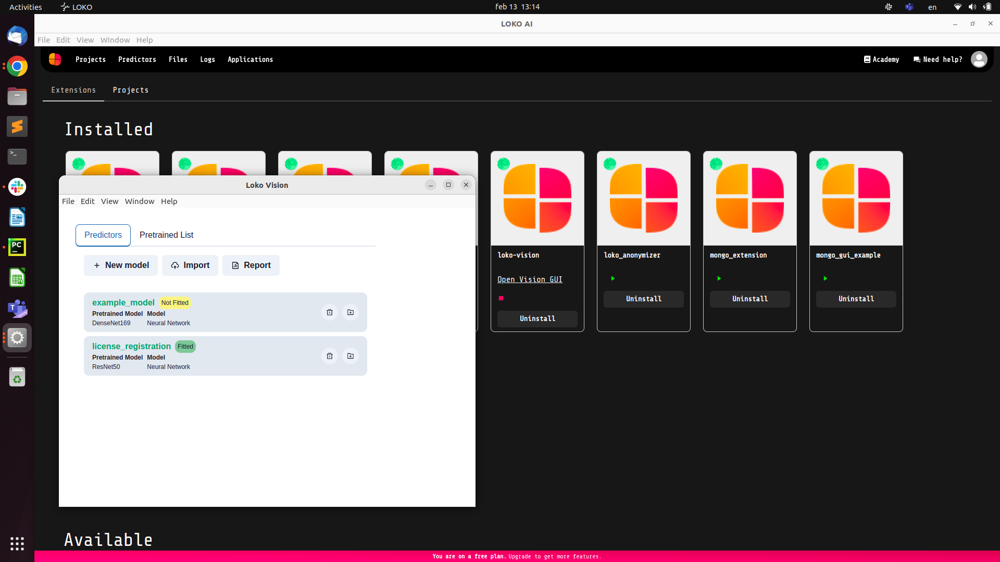
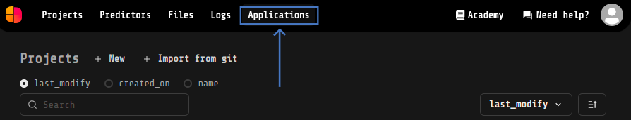
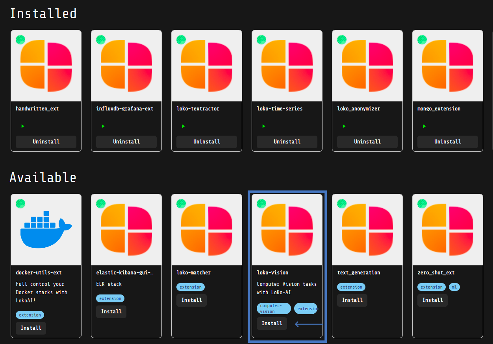
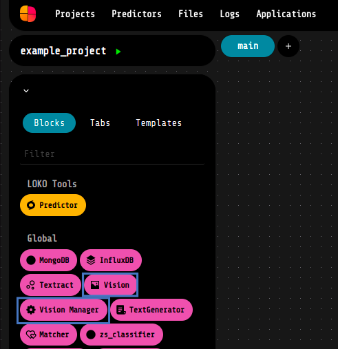
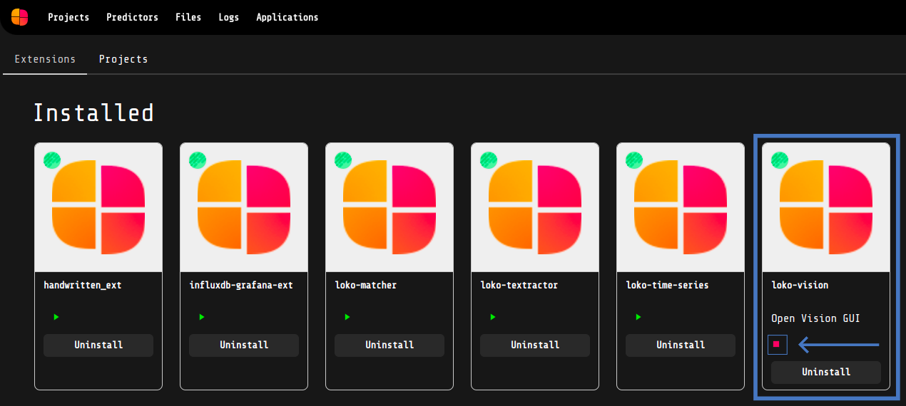

# :computer: Loko-vision: a Loko AI  extension for Image Classification

This LOKO AI extension contains components that allows to perform Transfer Learning to classify images, using Keras pre-trained Neural Networks models. 

It's also possible to classify images using directly Keras pre-trained Neural Network, without having to train your own model. In this case the available labels are the ones of the ImageNet Dataset (you can find the complete list [here](https://gist.github.com/yrevar/942d3a0ac09ec9e5eb3a)) 

# :inbox_tray: What's inside?

Installing this project extension on your LOKO AI software will make available two new components, Vision Manager and Vision, and a GUI. In details, their 

1. **Vision Manager:** allows to manage Creation, Delete of custom models and get info about them;
2. :crystal_ball: **Vision:** it's the main component of this LOKO AI extension, since it's the one that let you to fit a custom model, using **Transfer Learning** techniques, make predictions and evaluate a custom model;
3. **Vison GUI:** Vision offers a simple GUI which, among other tasks, allows to carry on the same tasks of the Vision Manager components (create, delete, get info about custom model), so it's up to you deciding if it's more convenient to use directly the component or the GUI, according to your needs. Through this interface you can also import/export models, check the pre-trained models list available for you, and take a look to an evaluation report.

# :electric_plug: Installation

- **Step 1:** In the top section click on the "Applications" field. 

- **Step 2:** In the Applications section, you can find the installed extensions and the available ones. Click on the install buttons in order to use the above mentioned components. 

- **Step 3:** Now that you have the extension installed in your local LOKO AI software, you can find the _Vision Manager_ and _Vision_ components in the Blocks lists, under the _"Global"_ group as shown in the figure below. 
 

- **Step 4:** to enable these blocks you have to click the play button on the installed applications, then a red square. The first time, it will take some times, because clicking on that button you are launching a Docker container, thus a Docker image will be built. Once the image is built, here you can find also the link to the Vision GUI. 

