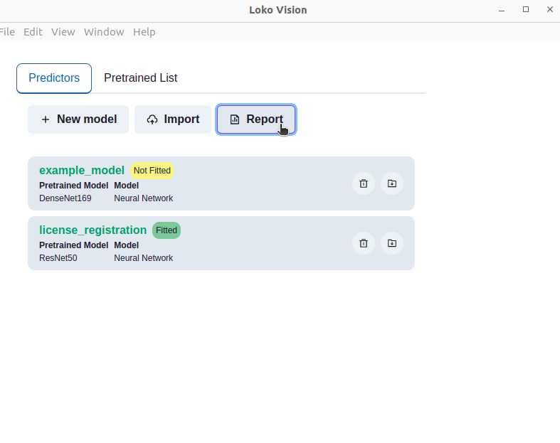

# :computer: Loko-vision: a LOKO AI  extension for Image Classification

This LOKO AI extension contains components that allow to perform Transfer Learning to classify images, using Keras pre-trained Neural Networks models. 

It's also possible to classify images using directly Keras pre-trained Neural Network, without having to train your own model. In this case the available labels are the ones of the ImageNet Dataset (you can find the complete list [here](https://gist.github.com/yrevar/942d3a0ac09ec9e5eb3a)) 

# :inbox_tray: What's inside?

Installing this project extension on your LOKO AI software will make available two new components, Vision Manager and Vision, and a GUI. In details:

1. :wrench: **Vision Manager:** allows to manage Creation, Delete of custom models and get info about them;
2. :crystal_ball: **Vision:** it's the main component of this LOKO AI extension, since it's the one that lets you to fit a custom model, using **Transfer Learning** techniques, make predictions and evaluate a custom model;
3. :tv: **Vison GUI:** Vision offers a simple GUI which, among other tasks, allows to carry on the same tasks of the Vision Manager components (create, delete, get info about custom model), so it's up to you deciding if it's more convenient to use directly the component or the GUI, according to your needs. Through this interface you can also import/export models, check the pre-trained models list available for you, and take a look to an evaluation report.

# :electric_plug: Installation

- **Step 1:** In the top section click on the "Applications" field. 

- **Step 2:** In the Applications section, you can find the installed extensions and the available ones. Click on the install buttons in order to use the above mentioned components. 

- **Step 3:** Now that you have the extension installed in your local LOKO AI software, you can find the _Vision Manager_ and _Vision_ components in the Blocks list, under the _"Global"_ group as shown in the figure below. 
 

- **Step 4:** to enable these blocks you have to click the play button on the installed applications, then a red square. The first time, it will take some times, because clicking on that button you are launching a Docker container, thus a Docker image will be built. Once the image is built, here you can find also the link to the Vision GUI. 

# :mag_right: How to use it?

This LOKO AI plugin could be use in two different way: to apply transfer learning over a pretrained model, to customize the classification model, or directly making predictions using one of the pretrained models.

### Straightforward _-ready to use-_ classification

This is the easiest scenario: to carry on a classification on a image with training a new model you can just use a _File Reader_ component and link it to the predict input of the _Vision_ component. Inside the latter block, configure the model to use and then just run the project and the flow itself. The classification label in return are the one related to the ImageNet dataset.

### Transfer Learning

To perform a Transfer Learning over a pretrained model it's required firstly to create the model. Hereby, you can either use the _GUI_ or the _Vision Manager_ component: either way you just have to decide the name, select the pretrained model to use, and eventually choose a tag to facilitate the model identification.

The next step is the model training, which can be easily done by linking a _FileReader_ block to the "fit" input of a Vision block and selecting the model to train. The file to use for training needs to be a .zip file which needs to contains a folder for each label you want to have and each of the folder names' will represent the label name itself. For example, in the image below we have a zip file "license_dataset.zip", and two folder: registration and license. These two names, using this file to train a model, will represent the labels name. 

It's also possible to train a multilabel model: in order to do so, you just have to parse a zip data with nested folder, such as:

- Dog
  - Labrador
  - Corgi
  - Chihuahua
- Cat
  - Bengal
  - Burmese
  - Chartreux

In this case, the model will take as labels all the folders name. When doing the predictions you can choose to use to have multilabel prediction or a classic multiclass. In the second case the labels will reconsidered as: "Dog-Labrador", "Dog-Corgi", "Cat-Bengal", and so on...

Once the training is done, you can use the customized model to make prediction and evaluate the model. To the evaluate input you need to pass necessarily a _.zip_ file, whilst to perform a prediction you can use eitherway a _.zip_ file or a single image (png, jpg, etc...).

Finally, once you have the model evaluation results, you can decide to save in a .eval file. It will always be in a json format, but in this way it will be recognized by the GUI as a possible report file, and you can visualize the model performance, as in the example below.

In order to do so, just open the GUI, click on the Report button (as shown in the following image) and search on your computer for the report you want to visualize.

# :wrench: Configuration

Inside this project you can find a file called "config.json", where you can set some property that the extension will have. Among the other configuration, you can set the volume of the Vision models: locally on your computer the models will be saved on the path _"/var/opt/loko/loko-vision/repo"_. If you want to customize this, you can directly change it in the config.json and save the new configuration.

  
    {
      "main": {
        "volumes": [
          "/var/opt/loko/loko-vision/repo:/plugin/repo"
        ],
        "environment": {
          "SANIC_REQUEST_MAX_SIZE": 500000000,
          "SANIC_REQUEST_TIMEOUT": 3600,
          "SANIC_RESPONSE_TIMEOUT": 3600
        },
        "gui": {
          "name": "Vision GUI",
          "path": "web/index.html"
        }
      }
    }